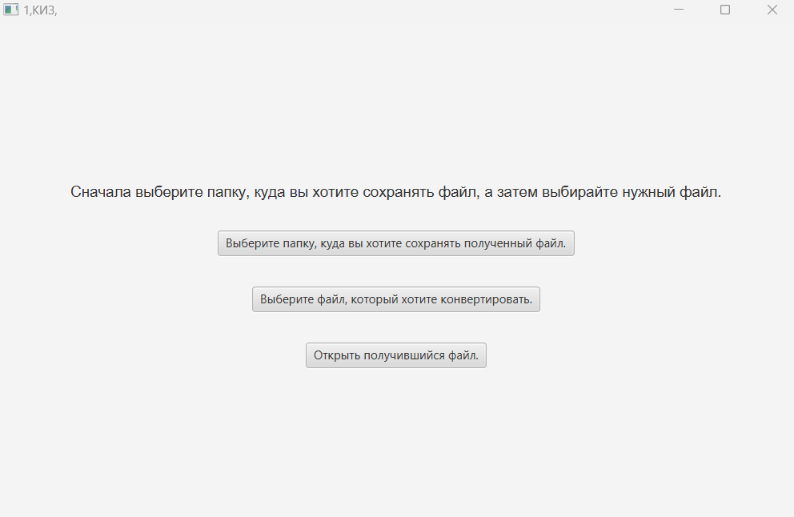

# ****  

## 1,KIZ, – Java-приложение для работы с "Честным знаком". 

### **Функциональные возможности.**
Приложение автоматизирует форматирование штрих-кодов из ведомости честного знака в файл для отгрузки на Wildberries. 
Пользователь получает от честного знака ведомость товаров в виде Excel файла с закодированными штрих-кодами, где 
закодированный текст в каждой строке соответствует штрих-коду отгружаемой позиции. Программа считывает закодированный 
текст и автоматически сохраняет в txt файл, который по формату соответствует требованиям Wildberries для отгрузки.

### **Технические особенности.**
Приложение реализовано с использованием Java 11 + JavaFX, для работы с Excel файлами используется библиотека Opencsv и 
Apache.poi. С помощью плагина Maven-assembly-plugin формируется runnable jar, на основе которого, с помощью Launch4j 
формируется exe файл. Для работы приложения необходимо установить на устройство "Amazon corretto jdk 11", который 
поставляется вместе с exe файлом самого приложения.

### **Интерфейс приложения состоит из 3 кнопок:**
1) Выбор директории для сохранения результата
2) Выбор файла, который необходимо форматировать
3) Просмотр получившегося результата, путем открытия конечного файла

